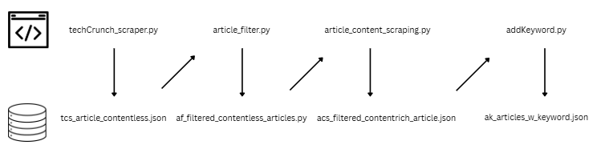

# 🧠 TrendScoutAI – AI Startup Trend Mining System

## 📌 Overview

TrendScoutAI is a multi-stage data pipeline that extracts, filters, enriches, and analyzes AI-related articles from TechCrunch to identify emerging trends in the startup ecosystem.

The system combines **web scraping, rule-based scoring, and TF-IDF analysis** to transform raw news data into structured insights such as trending keywords, funding activity, and technology patterns.

---

## 🚀 System Architecture

The pipeline consists of **4 main stages**:

---

## 🧩 Pipeline Architecture



*Figure: Multi-stage pipeline for scraping, filtering, content enrichment, and trend extraction.*

---

### 🔎 1. Multi-Source Web Scraping

* Scrapes articles from multiple TechCrunch categories:

  * AI
  * Startups
  * Venture
  * Security
  * Latest
* Handles pagination and multi-page extraction
* Merges duplicate articles using URL

📄 Output:

```
tcs_contentless_articles.json
```

---

### 🧠 2. Intelligent Article Filtering & Ranking

* Uses **keyword-based scoring system**:

  * AI terms (LLM, GPT, agents)
  * Funding signals (raise, seed, valuation)
  * Big tech (Google, Microsoft, etc.)
* Applies:

  * Lemmatization (WordNet)
  * Weighted scoring
  * Sigmoid normalization

👉 Filters only high-relevance articles

📄 Output:

```
af_filtered_contentless_articles.json
```

---

### 📄 3. Content Enrichment

* Fetches full article content using HTTP requests
* Extracts meaningful paragraphs
* Removes noise (ads, short text, irrelevant content)

📄 Output:

```
acs_filtered_contentrich_articles.json
```

---

### 📊 4. TF-IDF Keyword Extraction & Trend Detection

* Converts articles into TF-IDF vectors
* Boosts title importance for better relevance
* Extracts:

  * Top keywords per article
  * Global trending keywords

📄 Output:

```
ak_articles_w_keyword.json
```

---

## 🛠️ Tech Stack

* **Python**
* **Web Scraping**

  * BeautifulSoup
  * Requests
  * Selenium / Playwright (optional dynamic scraping)
* **Text Processing**

  * NLTK (Lemmatization)
* **Machine Learning**

  * Scikit-learn (TF-IDF)
* **Data Handling**

  * JSON, Pandas, NumPy

---

## 📂 Project Structure

```id="s9k2x1"
trendscoutai/
│
├── data/
│   ├── tcs_contentless_articles.json
│   ├── af_filtered_contentless_articles.json
│   ├── acs_filtered_contentrich_articles.json
│   ├── ak_articles_w_keyword.json
│
├── techCrunch_scraper.py
├── article_filter.py
├── article_content_scraper.py
├── addKeyword.py
├── requirements.txt
└── README.md
```

---

## ⚙️ Setup Instructions

### 1️⃣ Create virtual environment

```bash id="7g2k1a"
python -m venv venv
```

### 2️⃣ Activate environment

```bash id="3ks92m"
./venv/Scripts/Activate
```

### 3️⃣ Install dependencies

```bash id="l1x8zs"
pip install -r requirements.txt
```

---

## ▶️ How to Run (Full Pipeline)

Run scripts in order:

### Step 1: Scrape articles

```bash id="1d9qkz"
python techCrunch_scraper.py
```

### Step 2: Filter & rank

```bash id="8xk2ma"
python article_filter.py
```

### Step 3: Fetch content

```bash id="0a2kls"
python article_content_scraper.py
```

### Step 4: Extract keywords & trends

```bash id="p3m9ds"
python addKeyword.py
```

---

## 📊 Example Output

Each article contains:

```json id="0s9dk2"
{
  "title": "...",
  "url": "...",
  "score": 0.98,
  "content": "...",
  "keywords": ["ai", "startup", "funding"]
}
```

---

## 🔥 Key Innovations

* 🧠 Hybrid approach:

  * Rule-based filtering + ML (TF-IDF)
* 📈 Trend detection using keyword aggregation
* ⚡ Title boosting for better semantic importance
* 🔄 Multi-stage pipeline for data refinement

---

## 🔮 Future Scope

* 🤖 Convert into conversational AI agent
* 🔗 Build knowledge graph (Neo4j)
* 🧠 Use embeddings (BERT / OpenAI) for semantic similarity
* 📊 Dashboard for real-time trend visualization
* ⏱️ Automate continuous scraping

---

## 👨‍💻 Author

Yuvraj Rasal

---

## 📜 Academic Context

This project is developed as part of **Semantic Web Mining**, focusing on extracting structured knowledge from unstructured web data.
